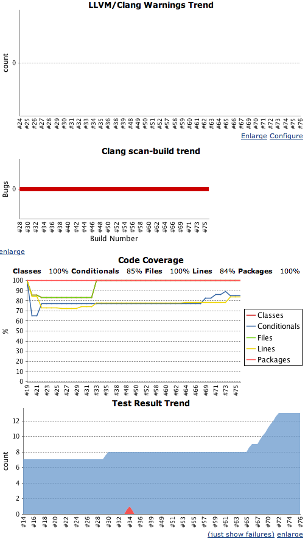

# Advanced Jenkins for iOS and Mac

This repo accompanies [my blog post on the subject](http://www.sailmaker.co.uk/blog/2013/04/02/advanced-jenkins-for-ios-and-mac/) and comprises:

* A project based on Apple's sample code `iPhoneUnitTests`.
* A directory `jobs` containing sample Jenkins jobs configs that can be copied to your Jenkins jobs directory.
* A directory `blogpost` containing the blog post and associated images.

The configs are comprehensive, displaying errors, static analyser results, unit tests and code coverage like this:

Enjoy!
